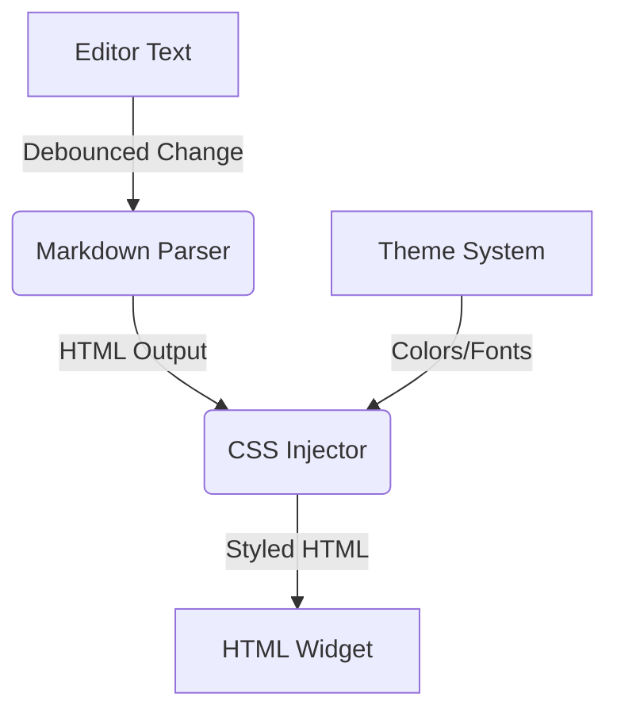

# Design: Improved Dynamic Rendering

## Architecture

The dynamic rendering system will follow a classic Model-View-Controller (MVC)-like pattern within the `EditorFrame`.

### Components

1.  **Markdown Parser:** We will use a Python-based parser. `markdown2` is preferred for its simplicity and "extras" support (tables, footnodes).
2.  **CSS Injector:** A utility that takes the current `src.ui.theme` values and generates a `<style>` block to be prepended to the HTML. This ensures the preview looks like the application.
3.  **HTML Widget:** We will transition from manual packing of `CTkLabel` to a single container holding an HTML-capable widget. 

### Performance Considerations

- **Debouncing:** Updates will continue to be debounced (currently 100ms) to avoid stuttering.
- **Incremental Updates:** For very large documents, we may eventually need to render only the visible part, but for thesis chapters (usually <20k words), full rendering is typically acceptable.

### Alternatives Considered

- **Pandoc to HTML:** Pandoc is powerful but launching a subprocess on every keystroke (even debounced) is significantly slower than using an in-process library like `markdown2`.
- **Custom Widget Parser (Current):** Maintaining a manual parser for every markdown edge case is a "reinventing the wheel" scenario that leads to bugs.
