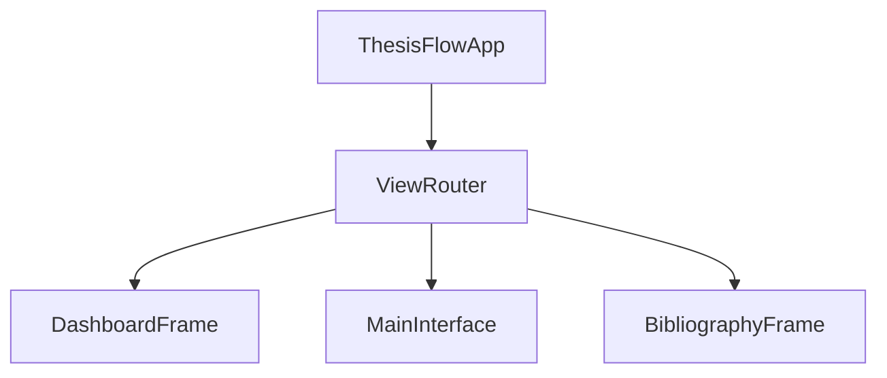

# Design: Routing and Icons

## Routing Architecture
We will introduce a `ViewRouter` in `src/ui/router.py`.

### ViewRouter Responsibilities
- Registering views (Dashboard, MainEditor, etc.).
- Managing the "current view" state.
- Handling entry/exit logic for views (e.g., saving data before leaving the editor).
- Providing a consistent API for navigation: `router.navigate("dashboard")`.

### Relationship with App
`ThesisFlowApp` will own the `ViewRouter` and delegate view switching to it. This decouples the main app logic from grid management.

## Icon System
The `IconFactory` will remain the consumer, but the source (`assets/icons`) will be fully populated.

### Updates to `generate_icons.py`
- Add `draw_sun`, `draw_moon`, `draw_eye`, `draw_maximize`, `draw_chevron_left`.
- Improve `draw_undo`, `draw_redo`, `draw_code`, `draw_quote` to be distinct.
- Add `draw_bib` (for bibliography).

### Runtime Validation
`IconFactory` will be updated to log an error with more context if an icon is still missing during development, but fallback safely in production.
